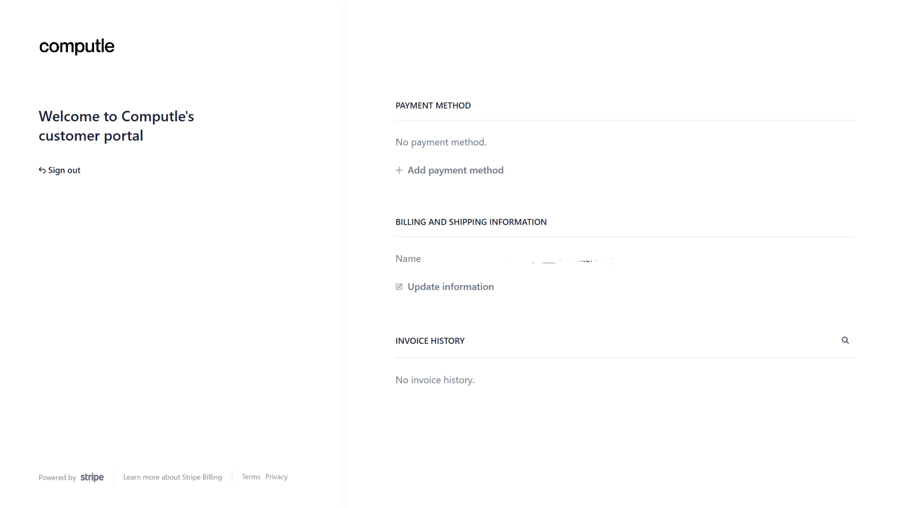

# Direct Debit Set Up

To set up a Direct Debit:

1. Navigate to the [Billing Portal](https://checkout.computle.com/p/login/6oEcOtdSkd4v2ha8ww).

<figure><figcaption></figcaption></figure>

2. Enter your email and click Send


Only the Billing Owner can log in to this page.


<figure><figcaption></figcaption></figure>

3. Open your emails.&#x20;
4. Locate the email from Computle with the subject "_Your Customer Portal Login Link"_

<figure><figcaption></figcaption></figure>

5. Click _Log In To Your Customer Portal_
6. Click _Add Payment Method_

<figure><figcaption></figcaption></figure>

7. Click _Bacs Direct Debit_ and complete the fields.

<figure><figcaption></figcaption></figure>

8. Tick the authorisation field.

<figure><figcaption></figcaption></figure>

9. Click Add.


Within the next 4 weeks, Stripe will contact you to confirm that the Direct Debit Mandate has been established.&#x20;


