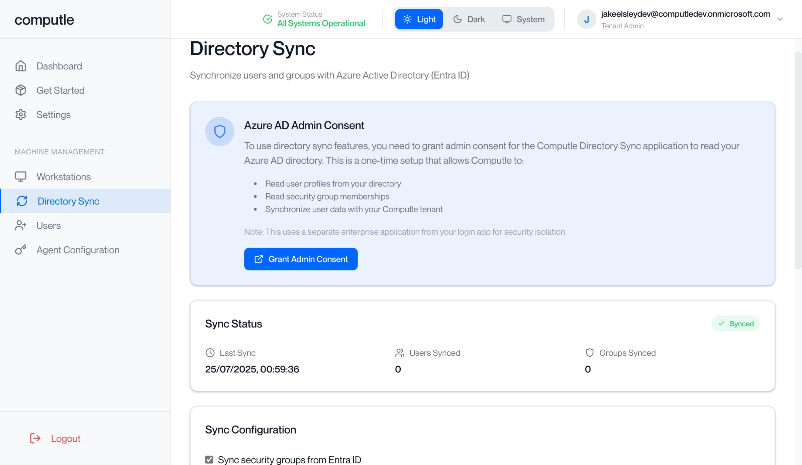
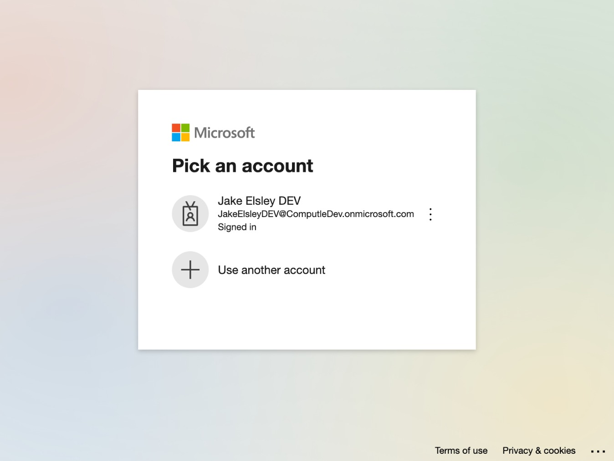
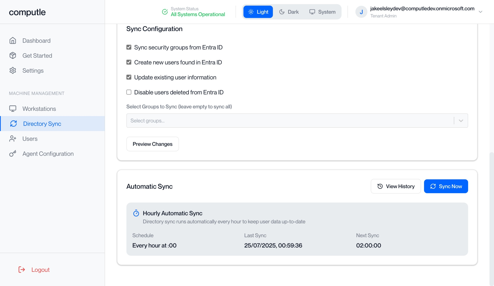
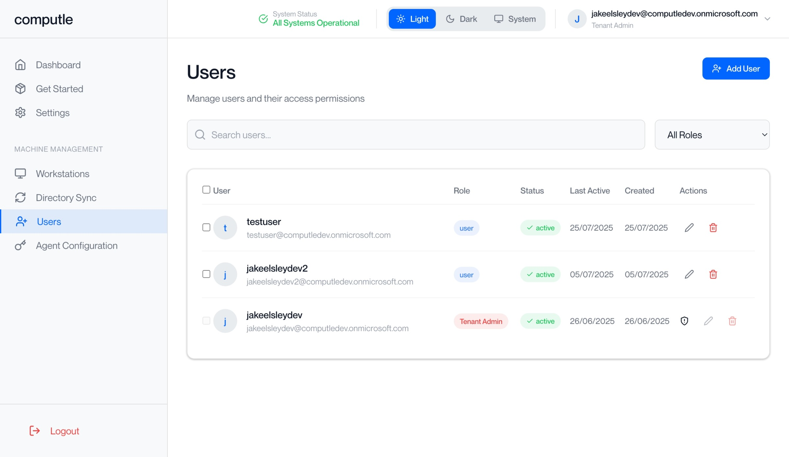

# Computle Client v3: Enterprise App Registration

Computle Client uses OAth 2.0 to authenticate users against your existing iDP, such as Entra ID. Additionally, Directory Sync automatically syncs Entra ID users to Computle, enabling machine assignment to users.

## Step 1: Computle Client Login Setup

### Steps

#### 1. Download and Install

* Download [Computle Client](../installers/installers.md)
* Follow installation steps

#### 2. Login Process

* Click **"Login with Microsoft"**
* Enter your work email
* Enter your password

#### 3. Grant Application Consent

* If requested, grant consent for Computle Client to:
  * Sign you in and read your profile
  * Maintain access to data you have given it access to
* Select **"Consent on behalf of your organisation"** if applicable


Admin approval may be required, See [Microsoft Learn](https://learn.microsoft.com/en-us/entra/identity/enterprise-apps/review-admin-consent-requests) for guidance.&#x20;


#### 4. Approval by Computle

* Once approved by Computle, you'll see your available machines. This is a manual step which takes up to 24 hours.&#x20;

***

## Step 2: Portal Directory Sync Setup

### Setup Steps

#### 1. Grant Admin Consent

* Navigate to [**Directory Sync**](https://portal.computle.com/directory-sync) in sidebar
* Click **"Grant Admin Consent"** button,


If approval is required, you will need to repeat these steps **in full** once permission is granted. The sync process will fail otherwise.


<figure><figcaption></figcaption></figure>

<figure><figcaption></figcaption></figure>

<figure><figcaption></figcaption></figure>

#### 2. Click Sync Now

* Click **"Sync Now"** button to start synchronization

<figure><figcaption></figcaption></figure>

#### 3. Verify Users

* Check **Users** section to see synced accounts

<figure><figcaption></figcaption></figure>

### You're set

Users from Entra ID are now available in Computle for machine assignment and access management.

***

## Requied Permissions

#### Computle OAuth 2.0 (Portal Login)

Used for user authentication to access the app and portal:

| Permission    | Type      | Description                   |
| ------------- | --------- | ----------------------------- |
| **email**     | Delegated | View users' email address     |
| **openid**    | Delegated | Sign users in                 |
| **profile**   | Delegated | View users' basic profile     |
| **User.Read** | Delegated | Sign in and read user profile |

#### Computle OAuth 2.0 (Tenant Sync)

Used for directory synchronization with these Microsoft Graph permissions:

| Permission               | Type        | Description                   |
| ------------------------ | ----------- | ----------------------------- |
| **Directory.Read.All**   | Application | Read directory data           |
| **Group.Read.All**       | Application | Read all groups               |
| **GroupMember.Read.All** | Application | Read all group memberships    |
| **User.Read.All**        | Application | Read all users' full profiles |

> **Microsoft Graph API** enables applications to access Microsoft 365 data and intelligence through a unified REST API endpoint.
