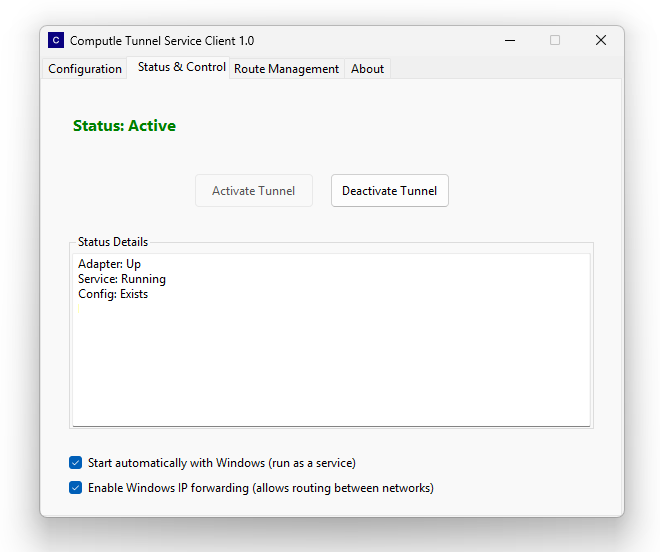

# Computle Tunnel

## Computle Tunnel

### Overview

Computle Tunnel is a WireGuard-based site-to-site tunnel service that provides secure, encrypted connections between customer environments and Computle infrastructure. Leveraging the high-performance WireGuard protocol, Computle Tunnel offers a software-defined approach to secure networking, eliminating the need for traditional hardware VPNs or complex firewall configurations.

<figure><figcaption></figcaption></figure>

<figure><figcaption></figcaption></figure>

### Key Features

* **Software-defined networking**: Pure software implementation with no hardware dependencies
* **Outbound connection model**: No inbound port forwarding required
* **End-to-end encryption**: WireGuard protocol ensures all traffic is encrypted
* **Per-tenant isolation**: Dedicated tunnel instances for each customer
* **Dual operational modes**: Relay server or direct site-to-site connections

### Operational Modes

#### Relay Server Mode

In Relay Server mode, Computle provisions a dedicated relay server within your tenant namespace on Computle's infrastructure. This server acts as a central connection point for all your sites, enabling:

* Centralised traffic management within your Computle environment
* Simplified routing between multiple customer sites
* Consistent performance through Computle's high-bandwidth backbone
* Integration with tenant-specific security policies

Each relay server operates within your assigned IP range (see global subnet table) and is accessible only through authenticated tunnel connections.

#### Direct Site-to-Site Mode

In Direct Site-to-Site mode, your on-premises equipment establishes an outbound connection to Computle's infrastructure, which then facilitates a direct peer-to-peer connection between sites:

1. Customer site initiates an outbound connection to Computle's coordination service
2. Computle authenticates the connection using tenant-specific credentials
3. The coordination service facilitates NAT traversal between sites
4. A direct encrypted tunnel is established between locations

This approach provides optimal performance by routing traffic directly between sites after the initial connection setup.

### Security Framework

Computle Tunnel incorporates multiple security layers:

* **WireGuard protocol**: Modern cryptography with perfect forward secrecy
* **Outbound-only connections**: No inbound ports required on customer firewalls
* **Tenant isolation**: Each tunnel service operates within tenant-specific namespaces
* **Authentication**: Pre-shared keys and certificates tied to tenant ID
* **Traffic encryption**: All data in transit is encrypted using industry-standard protocols

### Network Architecture Integration

Computle Tunnel seamlessly integrates with our architecture, connecting directly to tenant routers within our global infrastructure. This integration allows Tunnel traffic to benefit from the same high-performance networking that supports all Computle services:

* Direct access to 40Gbps and 100Gbps aggregation layers
* Low-latency routing through our global carrier network
* Dedicated bandwidth allocations within tenant namespaces
* Automatic failover through redundant network paths

### IP Addressing and Routing

Computle Tunnel uses dedicated address ranges for routing traffic between sites, including:

* 192.0.0.0/24
* 192.0.2.0/24
* 192.88.99.0/24
* 198.18.0.0/15
* 198.51.100.0/24
* 203.0.113.0/24
* 233.252.0.0/24

### Technical Implementation

Computle Tunnel is powered by a robust Windows service application that manages WireGuard VPN tunnels through a REST API interface. This enables seamless integration with the Computle Orchestrator for centralized management. Key components include:

* **Service Management**: Handles tunnel service lifecycle with automatic recovery
* **Tunnel Configuration**: Manages WireGuard configuration with security best practices
* **Status Monitoring**: Real-time monitoring of tunnel state and connectivity
* **Audit Logging**: Comprehensive logging for security and troubleshooting

### Deployment Process

1. Computle provisions tunnel endpoints within your tenant namespace
2. Configuration files are generated for each site you need to connect
3. Software clients are deployed to your on-premises equipment
4. Outbound connections establish the initial tunnel
5. Encrypted routes are automatically configured between sites

No complex firewall configurations or port forwarding rules are required. The software establishes outbound connections using standard HTTPS ports (443), enabling the tunnel to function in environments with restrictive security policies.

### Global Availability

Computle Tunnel is available in all Computle regions, allowing you to establish secure connections between your sites and any Computle location worldwide. The service leverages our global carrier partnerships to ensure optimal routing and low latency.

### Integration with Computle Broker

Computle Tunnel works seamlessly with Computle Broker, enabling:

* Automatic machine assignment across connected sites
* Dynamic routing updates as resources change
* Unified authentication through Broker API keys
* Consistent user experience across locations

The Tunnel service complements Broker's machine assignment capabilities by providing the secure network layer over which Broker communications can travel.

### Security and Resiliency

Like all Computle services, Tunnel implements comprehensive security and high availability:

* **Resilient infrastructure**: Multiple tunnel endpoints per region
* **Automatic failover**: Instant rerouting if a connection is disrupted
* **Encrypted configuration**: All setup parameters are securely transmitted
* **Health monitoring**: Continuous tunnel status verification
* **Caching for reliability**: Local caching of connection parameters

### Availability and Pricing

Contact your Computle account representative to enable Computle Tunnel for your tenant environment. Our team will work with you to design the optimal tunnel configuration for your specific requirements and provide all necessary software and configuration files. This service is provided free of charge to existing customers.

