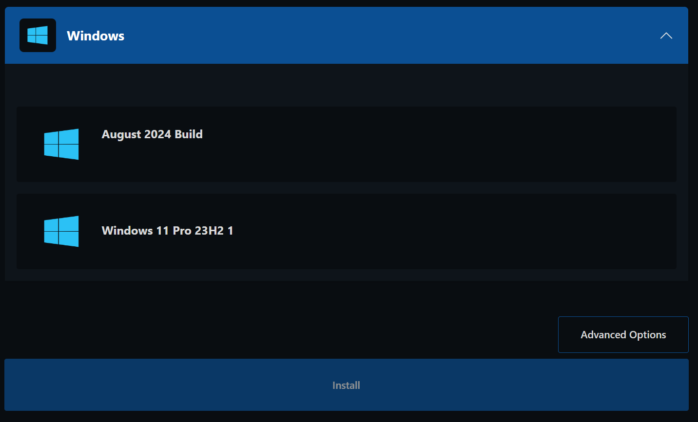

# Resolution/quality issues

## TCP mode

By default, Computle uses TCP mode to transport display pixels.&#x20;

You can see which mode you are using by clicking the _Cog > Streaming Mode_ and then checking for  TCP/WebSocket mode, or QUIC mode.&#x20;

<figure><figcaption></figcaption></figure>

## QUIC/UDP

On connections with a latency of above 50ms, we recommend enabling UDP/QUIC mode. However, if you core switches and routers do not support Jumbo Frames, this may have a determinental effect on performance.&#x20;

**To enable UDP/QUIC mode:**

* Open Regedit
* Go to “HKEY\_USERS/S-1-5-18/Software/GSettings/com/nicesoftware/dcv/connectivity”
* Double click “enable-quic-frontend” and change value to 1.&#x20;
* Reboot Computle.
* Within the DCV application, selected QUIC.&#x20;
